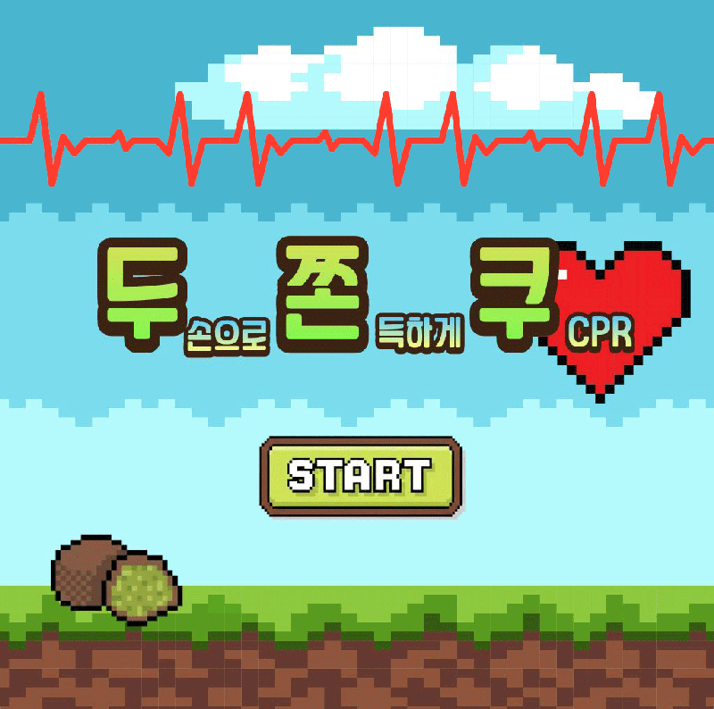
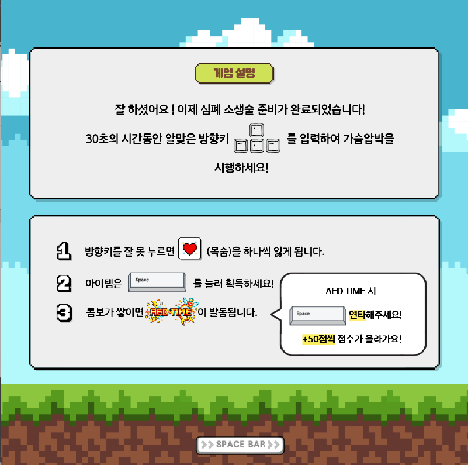
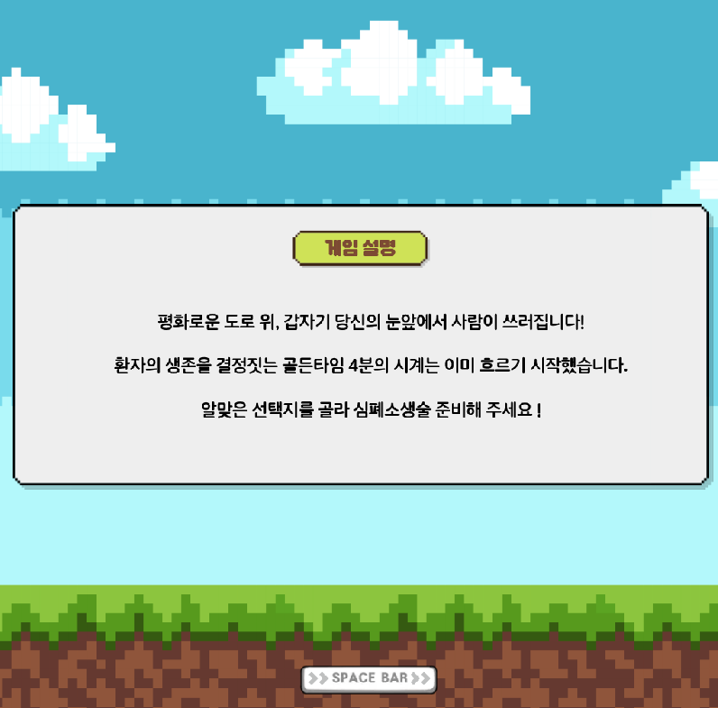
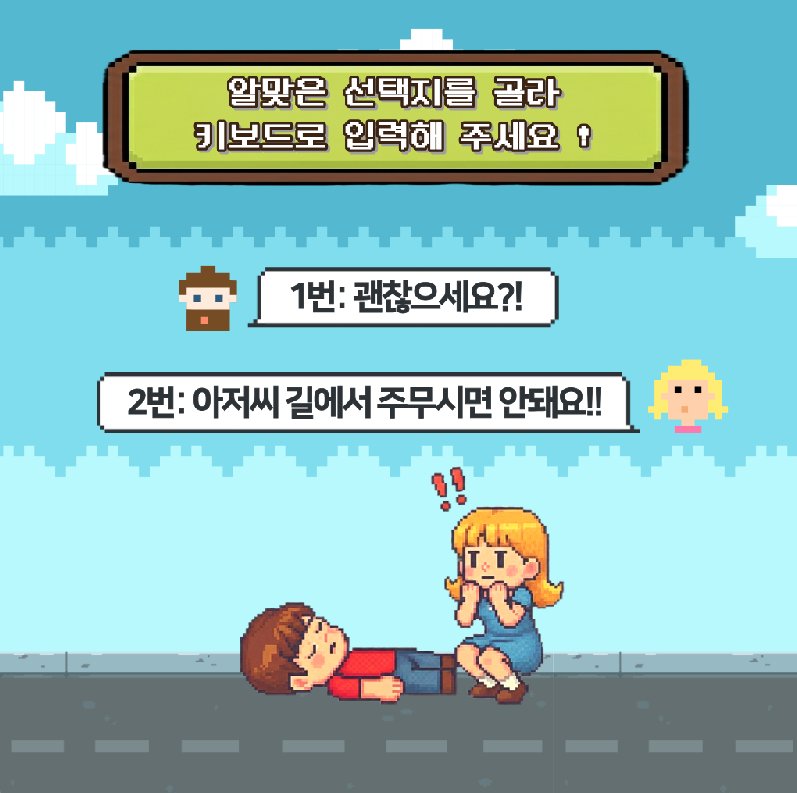
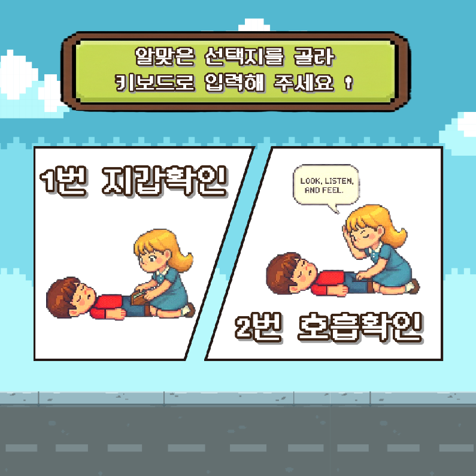
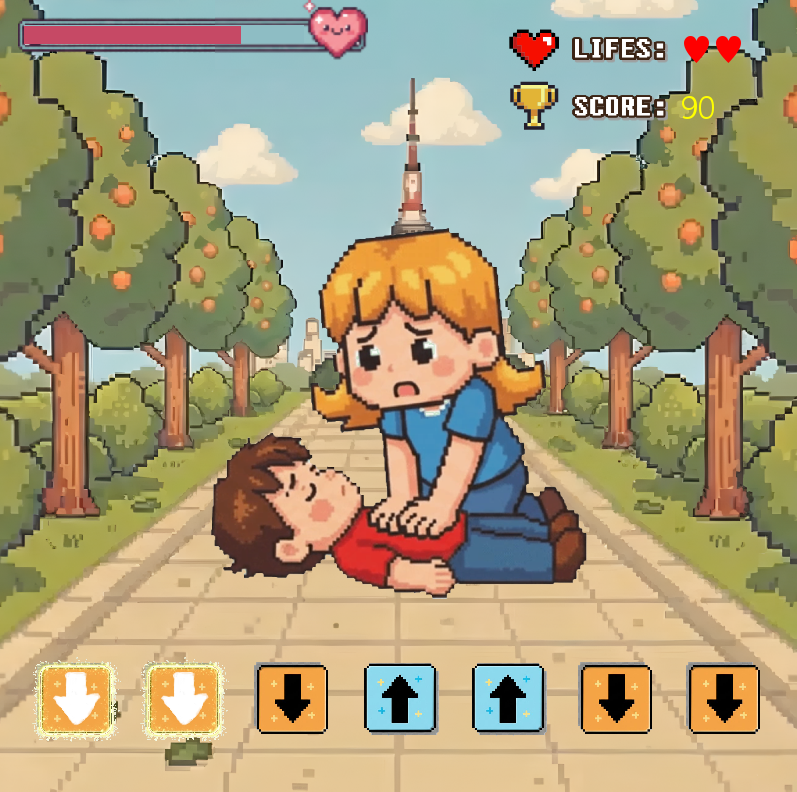
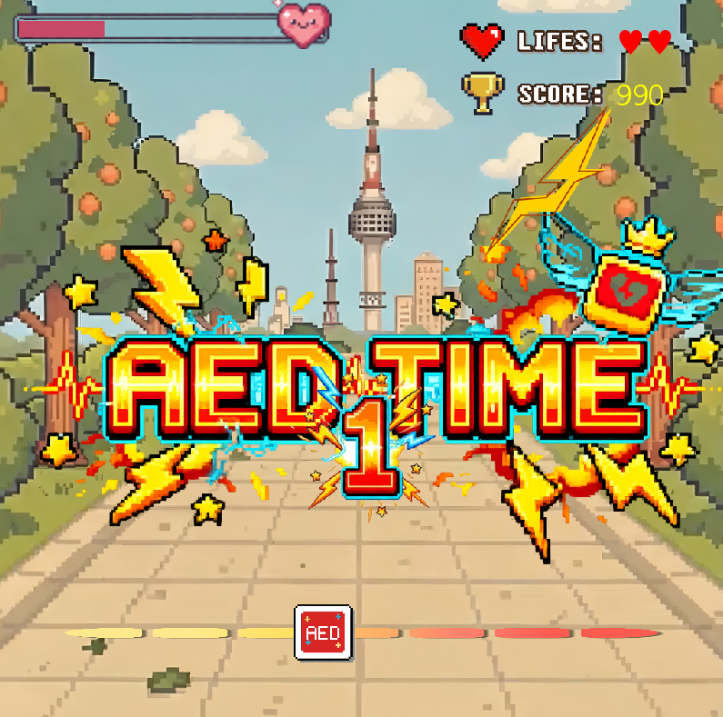
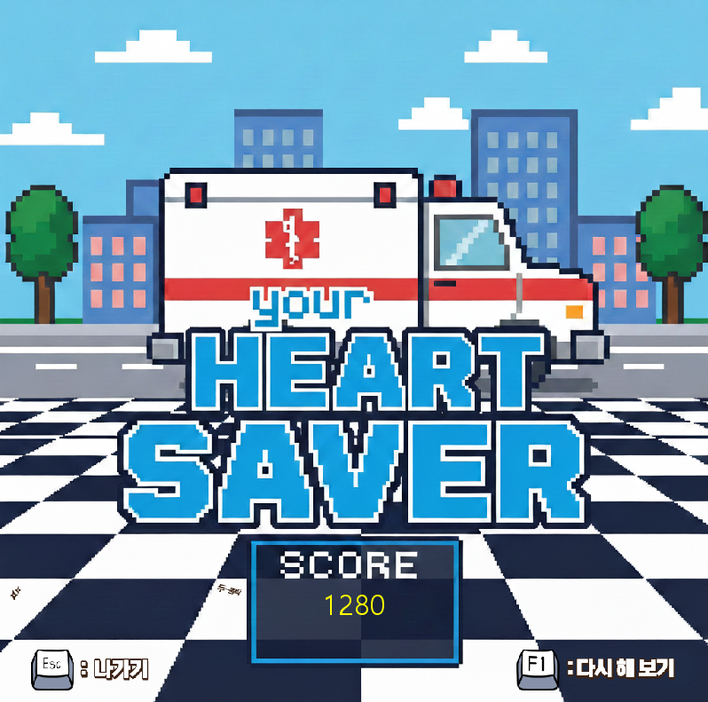

# 🫀 두쫀쿠 CPR - 리듬 게임

> **CPR 교육을 목적으로 제작된 리듬 기반 pygame 게임**  
> 의학적 고증에 기반한 110 BPM 가슴압박 리듬을 게임으로 체험합니다.

---

## 🎬 시연 영상 & 발표 자료

https://github.com/user-attachments/assets/71669ca7-6afa-4745-8c67-3c00f85462d4

📂 **발표 자료:** [`파이썬을 활용한 CPR_GAME.pptx`](파이썬을%20활용한%20CPR_GAME.pptx)

---

## 📌 프로젝트 소개

**두쫀쿠 CPR**은 심폐소생술(CPR)의 올바른 가슴압박 속도(**분당 110회**)를 플레이어가 리듬 게임 형식으로 직접 체험하며 익힐 수 있도록 설계된 pygame 기반 교육용 게임입니다.

시나리오 모드를 통해 알맞은 심폐소생술의 순서와 정보를 취득하며

화면속 화살표 방향에 맞게 키보드 방향키를 박자에 맞게 누르면 PERFECT / GREAT / MISS 판정이 내려지며, 실제 CPR 훈련에 필요한 압박 속도 감각을 자연스럽게 습득할 수 있습니다.

---

## 🖼️ 게임 화면

<table>
  <tr>
    <td align="center"><b>🎬 타이틀</b></td>
    <td align="center"><b>📖 게임 방법</b></td>
  </tr>
  <tr>
    <td></td>
    <td></td>
  </tr>
  <tr>
    <td align="center"><b>🎮 게임플레이 1</b></td>
    <td align="center"><b>🎮 게임플레이 2</b></td>
  </tr>
  <tr>
    <td></td>
    <td></td>
  </tr>
  <tr>
    <td align="center"><b>🎮 게임플레이 3</b></td>
    <td align="center"><b>🎮 게임플레이 4</b></td>
  </tr>
  <tr>
    <td></td>
    <td></td>
  </tr>
  <tr>
    <td align="center"><b>🎮 게임플레이 5</b></td>
    <td align="center"><b>🏆 결과 화면</b></td>
  </tr>
  <tr>
    <td></td>
    <td></td>
  </tr>
</table>

---

## 🎮 게임 방법

| 단계 | 동작 |
|------|------|
| 1 | 시나리오 모드에서 CPR 절차에 맞는 숫자를 눌러 시작 |
| 2 | 게임 실행 후 화면이 뜨면 `SPACE`를 눌러 시작 |
| 3 | 화면 중앙의 캐릭터를 보며 110 BPM 박자에 맞춰 `SPACE` 반복 입력 |
| 4 | PERFECT / GREAT / MISS 판정과 점수 확인 |


### 🏅 판정 기준

| 판정 | 오차 범위 | 점수 |
|------|----------|------|
| 🟢 PERFECT | ±0.12초 이내 | +100점 |
| 🟡 GREAT | ±0.22초 이내 | +50점 |
| 🔴 MISS | 범위 초과 및 잘못된 화살표 입력시 | 0점 |

---

## 🩺 의학적 배경

> **CPR 국제 가이드라인 (AHA 2020)**에 따르면  
> 성인 가슴압박은 **분당 100~120회**를 유지하는 것이 권장됩니다.

본 게임은 **110 BPM**을 기준 박자의 노래와 함께 플레이 되며, 플레이어가 올바른 CPR 리듬을 자연스럽게 체득할 수 있도록 합니다.

---

## 🗂️ 프로젝트 구조

```
CPR_Project/
│
├── main.py              # 메인 실행 파일 (씬 매니저 & 게임 루프)
├── config.py            # 전역 설정 (화면 크기, BPM, 색상, 경로)
├── rhythm_engine.py     # 핵심 리듬 판정 엔진 (박자 계산 & 점수 로직)
├── test_logic.py        # 개발용 프로토타입 테스트 파일
│
├── scenes/              # 씬(화면) 모듈 디렉토리
│   ├── title_scene.py       # 타이틀 화면
│   ├── scenario_scene.py    # 스토리 / 시나리오 화면
│   ├── rhythm_scene.py      # 메인 리듬 게임 화면
│   └── result_scene.py      # 결과 화면
│
├── assets/
│   └── images/
│       └── bg_title.png     # 타이틀 배경 이미지
│
└── docs/
    └── screenshots/         # 게임 스크린샷 & 시연 영상
```

---

## ⚙️ 기술 스택

| 항목 | 내용 |
|------|------|
| 언어 | Python 3.11 |
| 게임 엔진 | pygame 2.x |
| 아키텍처 | 씬 기반(Scene-based) 구조 |
| 리듬 판정 | 시간(time 모듈) 기반 오프셋 계산 |

---

## 🚀 실행 방법

### 1. 요구사항 설치

```bash
pip install pygame
```

### 2. 게임 실행

```bash
python main.py
```

> ✅ Python 3.10 이상 권장  
> ✅ Windows 환경에서 테스트 완료

---

## 🏗️ 주요 구현 사항

### 리듬 엔진 (`rhythm_engine.py`)
- `time.time()`을 이용해 입력 시점과 BPM 기준 박자 사이의 **오프셋(오차)** 을 실시간 계산
- 오차 범위에 따라 PERFECT / GREAT / MISS 3단계 판정 반환
- 110 BPM 기준 박자 간격: **약 0.545초**

### 씬 매니저 (`main.py`)
- `DujjonkuGame` 클래스가 게임 전체 루프와 씬 전환을 담당
- `RhythmEngine`을 주입받아 판정 결과 및 점수를 실시간 렌더링

### 설정 관리 (`config.py`)
- 화면 크기, FPS, 색상, 경로를 중앙 집중식으로 관리
- `os.path`를 이용해 플랫폼에 무관한 에셋 경로 처리

---

## 👩‍💻 개발자

| 이름 | GitHub |
|------|--------|
| areum-mong | [@areum-mong](https://github.com/areum-mong) |

---

## 📝 라이선스

본 프로젝트는 교육 및 포트폴리오 목적으로 제작되었습니다.
